# VeriChain Architecture

> Decentralized Proof-of-Achievement System with Soulbound Credentials

## System Overview


## Smart Contract Architecture


## Credential Issuance Flow


## Credential Verification Flow

```mermaid
sequenceDiagram
    autonumber
    participant V as ✅ Verifier
    participant F as 🖥️ Frontend
    participant C as ⛓️ Smart Contract
    participant P as 📁 IPFS

    V->>F: Enter credential ID
    F->>C: verifyCredential(tokenId)
    C->>C: Check existence
    C->>C: Check revocation status
    C-->>F: Return verification result

    alt Credential Valid
        F->>C: tokenURI(tokenId)
        C-->>F: Return IPFS URI
        F->>P: Fetch metadata
        P-->>F: Return metadata JSON
        F->>C: ownerOf(tokenId)
        C-->>F: Return holder address
        F-->>V: Display verified credential
    else Credential Invalid/Revoked
        F-->>V: Display error status
    end
```



## Holder Portal Flow

```mermaid
flowchart TD
    A[🎓 Holder Opens Portal] --> B{Wallet Connected?}
    B -->|No| C[Connect MetaMask]
    C --> D{Connection Successful?}
    D -->|No| E[Show Error]
    D -->|Yes| F[Get Wallet Address]
    B -->|Yes| F

    F --> G[Query Smart Contract]
    G --> H[getCredentialsByHolder]
    H --> I{Has Credentials?}

    I -->|No| J[Show Empty State]
    I -->|Yes| K[Loop Through Token IDs]

    K --> L[Fetch tokenURI]
    L --> M[Fetch IPFS Metadata]
    M --> N[Check Revocation Status]
    N --> O[Build Credential Card]
    O --> P{More Tokens?}
    P -->|Yes| K
    P -->|No| Q[Display All Credentials]

    Q --> R[Show Statistics]
    R --> S[Valid Count / Revoked Count]
```



## Credential Revocation Flow


## Access Control Model

```mermaid
flowchart LR
    subgraph Roles["🔑 Roles"]
        Admin["DEFAULT_ADMIN_ROLE"]
        Issuer["ISSUER_ROLE"]
    end

    subgraph AdminActions["🔐 Admin Actions"]
        A1["Grant ISSUER_ROLE"]
        A2["Revoke ISSUER_ROLE"]
        A3["Manage System Settings"]
    end

    subgraph IssuerActions["🏛️ Issuer Actions"]
        I1["Issue Credentials"]
        I2["Revoke Own Credentials"]
        I3["View Issued Credentials"]
    end

    subgraph PublicActions["🌐 Public Actions"]
        P1["Verify Credentials"]
        P2["View Credential Details"]
        P3["Check Revocation Status"]
    end

    Admin --> A1
    Admin --> A2
    Admin --> A3
    Admin --> IssuerActions

    Issuer --> I1
    Issuer --> I2
    Issuer --> I3

    Anyone["Anyone"] --> PublicActions
```



## Data Flow Architecture


## Technology Stack


## Security Model

```mermaid
flowchart TB
    subgraph Threats["⚠️ Threat Vectors"]
        T1["Unauthorized Issuance"]
        T2["Credential Forgery"]
        T3["Replay Attacks"]
        T4["Metadata Tampering"]
    end

    subgraph Mitigations["🛡️ Security Controls"]
        M1["Role-Based Access"]
        M2["On-Chain Hash Verification"]
        M3["Unique Token IDs"]
        M4["IPFS Content Addressing"]
    end

    subgraph Properties["✅ Security Properties"]
        P1["Soulbound (Non-Transferable)"]
        P2["Immutable Once Issued"]
        P3["Publicly Verifiable"]
        P4["Tamper-Evident"]
    end

    T1 --> M1
    T2 --> M2
    T3 --> M3
    T4 --> M4

    M1 --> P1
    M2 --> P2
    M3 --> P3
    M4 --> P4
```



## Deployment Architecture

```mermaid
flowchart TB
    subgraph Development["🔧 Development"]
        Local["Hardhat Node"]
        LocalFE["localhost:3000"]
        LocalBE["localhost:3001"]
    end

    subgraph Staging["🧪 Testnet"]
        Sepolia["Polygon Amoy / Arbitrum Sepolia"]
        StageFE["Vercel Preview"]
        StageBE["Railway Staging"]
    end

    subgraph Production["🚀 Production"]
        Mainnet["Polygon / Arbitrum"]
        ProdFE["Vercel Production"]
        ProdBE["Railway Production"]
        ProdIPFS["Pinata Gateway"]
    end

    Local --> Sepolia
    LocalFE --> StageFE
    LocalBE --> StageBE

    Sepolia --> Mainnet
    StageFE --> ProdFE
    StageBE --> ProdBE
    StageBE --> ProdIPFS
```



## Contract Addresses

| Network | Contract | Address |
|---------|----------|---------|
| Localhost | VeriChainCredential | `0x5FbDB2315678afecb367f032d93F642f64180aa3` |
| Polygon Amoy | VeriChainCredential | *To be deployed* |
| Arbitrum Sepolia | VeriChainCredential | *To be deployed* |

## API Endpoints

| Method | Endpoint | Description | Auth |
|--------|----------|-------------|------|
| POST | `/api/credentials` | Issue new credential | ISSUER_ROLE |
| GET | `/api/credentials/:id` | Get credential details | Public |
| POST | `/api/credentials/revoke` | Revoke credential | ISSUER_ROLE |
| GET | `/api/verify/:id` | Verify credential | Public |
| POST | `/api/institutions` | Register institution | ADMIN |
| GET | `/api/institutions` | List institutions | ADMIN |

## Event Log Structure


---

## Quick Start

```bash
# Start all services
node scripts/start-dev.js

# Or manually:
npx hardhat node                    # Terminal 1: Blockchain
npx hardhat run scripts/deploy.js --network localhost  # Terminal 2: Deploy
cd backend && npm run dev           # Terminal 3: Backend
cd frontend && npm run dev          # Terminal 4: Frontend
```

## Color Palette

| Role | Color | Hex |
|------|-------|-----|
| Primary | Deep Blue-Gray | `#555879` |
| Secondary | Light Slate | `#98A1BC` |
| Accent | Warm Cream | `#DED3C4` |
| Background | Light Cream | `#F4EBD3` |

---

*Generated for VeriChain v1.0 - Soulbound Credential System*
